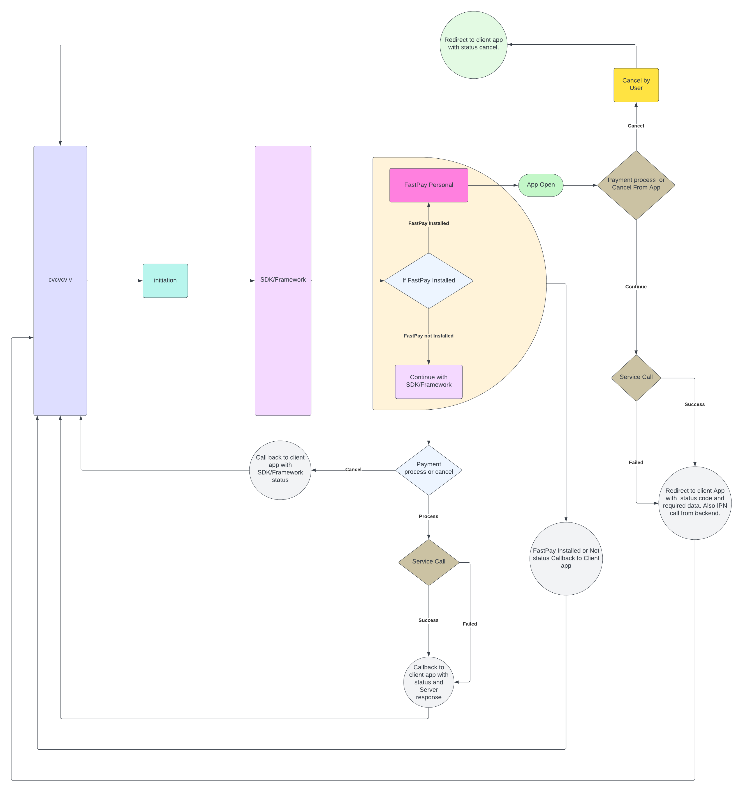

# FastPay Merchant SDK []()   []() 

[]()
[](https://fastpay.blackace.tech)
[](https://pypi.python.org/pypi/ansicolortags/)
[](https://shields.io/)


This is official documentation for fastpay merchant SDK.


## Features
1. Make payment transaction using Fastpay App.
2. Check the status of the payments which you make.
3. Verify payment with OTP.
4. SDK status provided by SDK callbacks.
5. Application redirect with required data while using fastpay personal applciation.

### SDK flow


## Initialization

Please follow the below steps to integrate the payment SDK to an applications.

#### Step-1
Users need to add below dependency to their app level build.gradle file :

```gradle
 dependencies {
   ...
   implementation("com.fastpay:merchant-sdk:LATEST_VERSION")
 }
```

#### Step-2 Gradle Configuration

#### For Gradle 7.0 and Higher:
If you're using Gradle version 7.0 or higher, you can utilize the dependencyResolutionManagement block in your settings.gradle file to centralize dependency management configurations.
Open your settings.gradle file.
If you don't already have a dependencyResolutionManagement block, add it to the file:

```gradle
dependencyResolutionManagement {
   repositories {
        ...
        maven {
            url = uri("https://maven.pkg.github.com/FastPaySDK/FastpayAndroidSDK")
            credentials {
                username = "YOUR_GITHUB_USERNAME" // Replace with your GitHub username
                password = "YOUR_GITHUB_PERSONAL_ACCESS_TOKEN" // Replace with your GitHub PAT
            }
        }
   }
}
```

#### For Gradle Versions Prior to 7.0:
If you're using a Gradle version earlier than 7.0, you'll need to add the repository to the buildscript block in your build.gradle file at the project level.
Open the build.gradle file located in the root directory of your project.
Inside the buildscript block, add the maven repository:

```gradle
allprojects {
    repositories {
        ...
        maven {
            url = uri("https://maven.pkg.github.com/FastPaySDK/FastpayAndroidSDK")
            credentials {
                username = "YOUR_GITHUB_USERNAME" // Replace with your GitHub username
                password = "YOUR_GITHUB_PERSONAL_ACCESS_TOKEN" // Replace with your GitHub PAT
            }
        }
    }
}
```

#### Step-3 (Implementation)
 -  Import FastPaySDK in your class
```java
import com.fastpay.payment.model.merchant.FastpayRequest;
import com.fastpay.payment.model.merchant.FastpayResult;
```
 - Initiate FastPaySDK
    * **Store ID:** Merchant’s Store Id to initiate transaction
    * **Store Password:** Merchant’s Store password to initiate transaction
    * **Order ID/ Bill No:** Order ID/Bill number for the transaction, this value should be unique in every transaction
    * **Amount:** Payable amount in the transaction ex: “1000”
    * **Currency:** Payment currency in the transaction (Default: IQD)
    * **Environment:** Payment Environment to initiate transaction (SANDBOX for test & PRODUCTION for real life transaction).
    * **Call back Uri:** When the SDK redirect to the fastpay application for payment and after payment cancel or failed it throws a callback with this uri. It is used for deeplinking with the client app for catching callbacks from fastpay application.
    * **Callback( Sdk status, message):** There are four sdk status (e.g. *FastpayRequest.SDKStatus.INIT*) and status message.
 ```java
    public enum SDKStatus{
        INIT,
        PAYMENT_WITH_FASTPAY_APP,
        PAYMENT_WITH_FASTPAY_SDK,
        CANCEL
    }
```

#### Call back Uri

 ```java
callback URI pattern (SUCCESS): sdk://your.website.com/further/paths?status=success&transaction_id=XXXX&order_id=XXXX&amount=XXX&currency=XXX&mobile_number=XXXXXX&time=XXXX&name=XXXX
callback URI pattern (FAILED): sdk://your.website.com/further/paths?status=failed&order_id=XXXXX
``` 
 
#### Initiate Payment Process

```java
FastpayRequest request = new FastpayRequest(this, "*******", "*******",
                        amount, orderId, FastpaySDK.SANDBOX, "sdk://your.website.com/further/paths", (sdkStatus, message) -> Toast.makeText(SDKTestActivity.this,message,Toast.LENGTH_LONG).show());
request.startPaymentIntent(SDKTestActivity.this,sdkResultLauncher);
```
 - Receive Payment result 

 Create `sdkResultLauncher` to get transaction `success` & `failure` result using result code.
 Transaction success result can be receive from `FastpayResult` parcelable model using `FastpayResult.EXTRA_PAYMENT_RESULT` key and failure message can be receive as string using     `FastpayRequest.EXTRA_PAYMENT_MESSAGE` key.
 - Payment Success Data definition
   *  **Transaction Status:** Payment status weather it is success / failed.
   *  **Transaction ID:** If payment is successful then a transaction id will be available.
   *  **Order ID:** Unique Order ID/Bill number for the transaction which was passed at initiation time.
   *  **Payment Amount:** Payment amount for the transaction.
   *  **Payment Currency:** Payment currency for the transaction. 
   *  **Payee Name:** Payee name for a successful transaction.
   *  **Payee Mobile Number:** Payee name for a successful transaction.
   *  **Payment Time:** Payment occurrence time as the timestamp.


```java
private ActivityResultLauncher<Intent> sdkResultLauncher;

@Override
protected void onCreate(Bundle savedInstanceState) {
   super.onCreate(savedInstanceState);

   sdkResultLauncher = registerForActivityResult(
           new ActivityResultContracts.StartActivityForResult(),
           result -> {
              Intent data = result.getData();
              if (result.getResultCode() == Activity.RESULT_OK) {
                 if (data != null) {
                    FastpayResult fastpayResult = data.getParcelableExtra(FastpayResult.EXTRA_PAYMENT_RESULT);
                    if (fastpayResult != null) {
                       // Handle successful payment
                       Toast.makeText(this, "Payment Success! Transaction ID: " + fastpayResult.getTransactionId(), Toast.LENGTH_LONG).show();
                    }
                 }
              } else if (result.getResultCode() == Activity.RESULT_CANCELED) {
                 // Handle canceled or failed payment
                 String message = data != null ? data.getStringExtra(FastpayRequest.EXTRA_PAYMENT_MESSAGE) : "No message";
                 Toast.makeText(this, "Payment Canceled/Failed: " + message, Toast.LENGTH_LONG).show();
              }
           }
   );
}
```
#### Step-4 Register Callback URL in AndroidManifest.xml

To handle the payment result via deep linking, register the callback URL in your 
AndroidManifest.xml. Replace your-deeplink-url with your own scheme and host.

```xml
<activity android:name=".YourPaymentResultActivity">
    <intent-filter>
        <data android:scheme="sdk" android:host="your.website.com" android:pathPrefix="/further/paths" />
        <action android:name="android.intent.action.VIEW" />
        <category android:name="android.intent.category.DEFAULT" />
        <category android:name="android.intent.category.BROWSABLE" />
    </intent-filter>
</activity>
```
🔹 Example: If your callback URL is myapp://payments/callback, use:
```xml
<data android:scheme="myapp" android:host="payments" 
android:pathPrefix="/callback" />
```

🔹 Replace .YourPaymentResultActivity with the actual activity that will process the 
payment response.

 - Result from Call backUrl (Please use it onCreate or onResume)

 ```java
 String amount = getIntent().getData().getQueryParameter("amount");
 String orderId = getIntent().getData().getQueryParameter("order_id");
 String status = getIntent().getData().getQueryParameter("status");
 String transaction_id = getIntent().getData().getQueryParameter("transaction_id");
```
> :warning: **Be sure to use try catch**
## License

    Copyright (C) 2021 Fastpay Technologies

    Licensed under the Apache License, Version 2.0 (the "License");
    you may not use this file except in compliance with the License.
    You may obtain a copy of the License at

       http://www.apache.org/licenses/LICENSE-2.0

    Unless required by applicable law or agreed to in writing, software
    distributed under the License is distributed on an "AS IS" BASIS,
    WITHOUT WARRANTIES OR CONDITIONS OF ANY KIND, either express or implied.
    See the License for the specific language governing permissions and
    limitations under the License.

